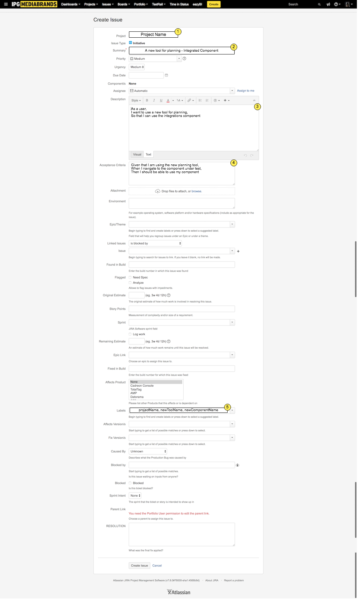
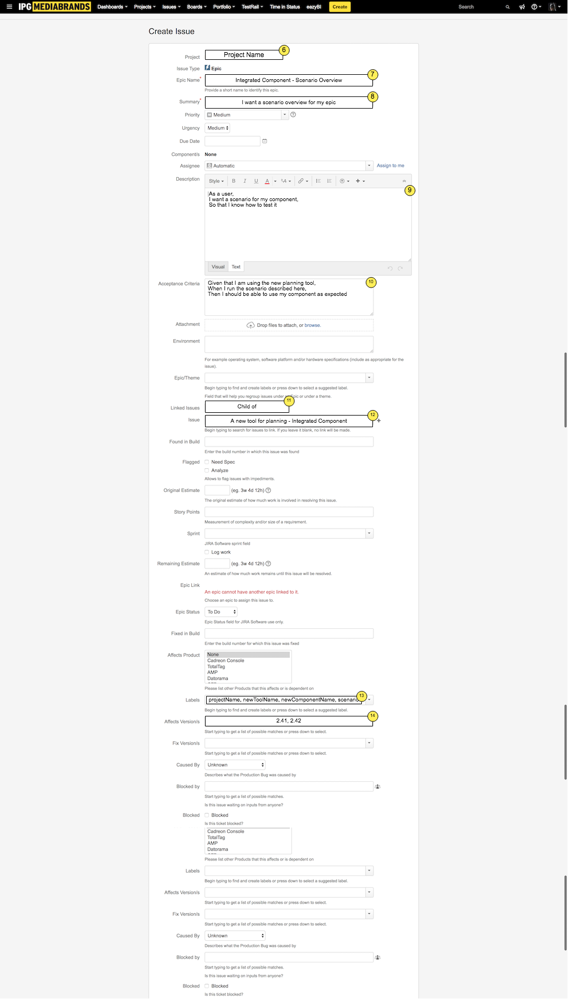
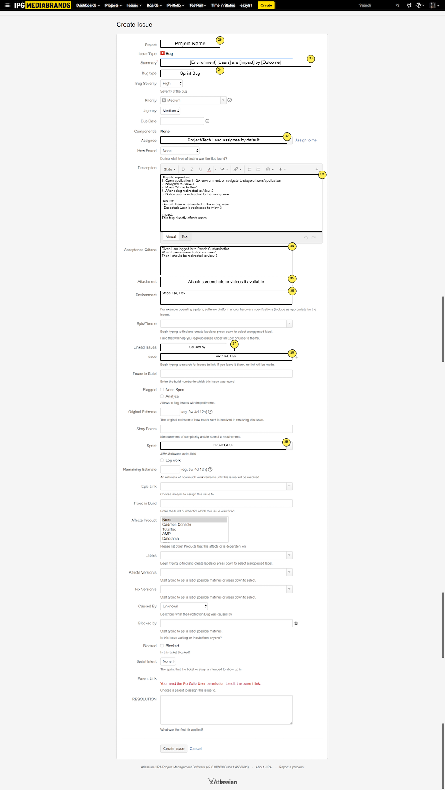

# Initiatives




# Epics



# Stories, Tasks &. Subtasks


# Bugs



## Notes

1. Project name, for example: "Reach Customizations", "Modeling and Optimizations"
2. Initiative Summary
	* We already use a naming convention to an extent, I'd like to see it standardized for all of our initiatives
	* 	The standard we use currently is:
		* Impact - Scope, a few examples below:
		* I want channel recommendations - Channel Recommendation
		* I want segments from Nielsen - Reach Customization
	* I want us to use the User-Story model when generating Initiatives and Epics, so that the context can be trickled down to stories and tasks
3. User Story as a description for our initiatives. Our initiatives, even our themes, should be captured in the form of a user story. Again this will help translate the goals defined by the stories to all layers of the process.
4. Gherkin/Cucumber acceptance criteria for our Initiatives, the acceptance criteria for our initiatives should be captured in 3 steps: Given, When, Then.
5. Labels: I want to use label help organize stories and tickets. I would like to find all tickets associated with a story or task by searching with a label. Our Labeling convention should be using camelCase, with hyphens, some examples:
	* someComponent-someObjective
	* reachCustomizations-nielsenSegments
	* optimization-convertingChannelRecommendationProjectToAnOptimization
6. Project name, for example: "Reach Customizations", "Modeling and Optimizations"
7. Epic name
	* The standard we use currently is:
		* Impact - Scope, a few examples below:
		* I want channel recommendations - Channel Recommendation
		* I want segments from Nielsen - Reach Customization
8. User story as a summary for our Epics. Our Epics, similar to our initiatives and stories, should follow the same model. This will help define acceptance criteria for stories and tasks. Some examples:
	* I want a scenario, user-story styled, summary for my epics
	* I want a button in Reach Customizations for Moments/Ripple
	* I want a flow for users coming from Channel Recommendations in Optimizations
9. User Story as a description for our epics. Our epics, like our initiatives, and if there are themes, like themes, should be in the form of user stories. These stories should umbrella under eachother in the following fashion:
	* Initiative:

		```
		As a user,
		I want a planning tool for channel recommendations
		So that I can use it in Reach Customizations and Optimizations
		```
	* Epic:

		```
		As a user,
		I want recommendations based on channel effeciency and max reach
		So that I know which channels to use in my media plan
		```
10. Acceptance criteria in Gherkin. Given, When, Then for all of our acceptance criteria for tickets that are Epics and below. This is ideal because it will help us define acceptance criteria for other child tickets in a reproducible fashion. The acceptance criteria should attempt to be concluded in 3 sentences, unless more detail on its criteria is needed. Some examples:
	* Initiative:

		```
		Given I am on Channel Recommendations,
		When I calculate Max Reach and Effectiveness using Connections and Targets
		Then I should have a project that I can use in Reach Customizations and Optimization
		```
	* Epic:

		```
		Given I am on Reach Customization
		When I open a channel reccomendation project
		Then I should be able to customize my reach based on channel effectiveness and max reach
		```
11. Link all children to their parent with "Child of" or "Relates to". This will allow us to dig deeper without much effort.
12. Use the ticket ID to link the ticket.
13. I'd also like to introduce labels. It would be nice for all Channel Recommendation issues accross all projects to share the same label, so we can identify all tasks more simply. For example:
	* All tickets in both MOPT and RC projects that are related to channel recommendations share the same label: `Channel-Recommendation`
14. I'd also like for us to either go back during plannning to identify which release is planned to contain this functionality. For example:
	* MegaBank issues in MOPT project that are planned for release `2.41` are linked to the release in the "Affects Version" section.
15. Project name, for example: "Reach Customizations", "Modeling and Optimizations"
16. Stories, Tasks and Subtasks should all follow the same user-story style summary pattern. This will continue to help define acceptance criteria. For example:
	* I want a button to redirect users to Reach Customizations from Channel Recommendations
	* I want to have a single project shared between the applications and components
17. All Stories, Tasks and Subtasks should have feasible and reviewed due dates.
18. Instead of having our scenarios in our epics, I would like to practice having our scenarios in Stories and Tasks. This will help with the organization of our work efforts. All automation "subtasks" now can have less information cause they fall in a story with more definition.
19. Example for "I want a flow for users coming from Channel Recommendations in Optimizations":
	* Story:

		```
		As a user,
		I want to be redirected to Reach Customization with my project,
		So that I can use my channel recommendations project and information

		Scenario: I want to be redirected to Reach Customization with my project
			Given I have a channel recommendation project
			And I have channels ranked by effectiveness
			And I have my Max Reach
			When I follow the Reach Customization link
			Then I should be in Reach Customization
			And I should be able to use my Channel Recommendations project
			And I should be able to customize my reach
		```
20. The acceptance criteria for the example story above is really defined in the description, so I propose we use the Acceptace criteria section to list all the scenarios in an array. Example:
	* I want to be redirected to Reach Customization with my project, I want to be redirected to Reach Customization without my project and be prompted to create one.
21. For stories, we should try to attach any design documents that apply to the ticket.
22. Link all children to their parent with "Child of" or "Relates to". This will allow us to dig deeper without much effort.
23. Use the ticket ID to link the ticket.
24. All Stories, Tasks and Subtasks, should have a point estimate, unless they are not developmental tasks.
25. All Stories, Tasks and Subtasks, if picked up by the sprint, should have a sprint link.
26. All Stories (only Stories) should have an epic link
27. Again, labels. Something to help organize our tickets.
28. Fix Version. Similar to the Affect Versions tag for our Epics, this tag would help up identify which version is this issue developed in. For example:
	* Epic - Affects Version (to be release in this version): `2.41`
	* Story - Fix Version (to be coded in this version): `2.40`
29. Project name, for example: "Reach Customizations", "Modeling and Optimizations"
30. Bug Summary. We also have a format for this but I would like to take a step further and identify it as a definition for our Bug Summary. `[Environment] [Users] are [Impact] by [Outcome]`, for example:
	* [QA] Users cannot move projects from Channel Recommendation to Reach Customization because a flag is missing
31. Identify where this bug was captured: Regression, Sprint, etc.
32. All bugs MUST have an assignee. My suggestion is to assign it to the project or technical lead by default.
33. Please see [Steps to Reproduce](./ReproducingBugs.md) for infromation on how to reproduce bugs. Otherwise, this is possibly the most important part of creating bugs. Example:
	* Description:

		```
		Steps to reproduce:
		1. Open application in QA environment, or navigate to stage.url.com/application
		2. Navigate to /view-1
		3. Press "Some Button"
		4. After being redirected to /view-2
		5. Notice user is redirected to the wrong view

		Results:
		- Actual: User is redirected to the wrong view
		- Expected: User is redirected to /view-3

		Impact:
		This bug directly effects users
		```
34. Acceptance criteria for bugs. This is also important to identify. How will this be tested, to what degree will testing occur? How does development know to stop? For example:
	* Acceptance Criteria:

		```
		Given I am logged in to Reach Customization
		When I press some button on view-1
		Then I should be redirected to view-3
		```
35. Attach screenshots and videos for bugs where available.
36. Where was this issue discovered? Where is this issue reproducible? How many environments are vulnerable to this issue?
37. This is also another step I would like to implement. This would help us identify the feature that led to this bug. We usually have this information. In fact, over 80% of the bugs we create are created with origin known, therefore, I suggest linking it in the ticket.
